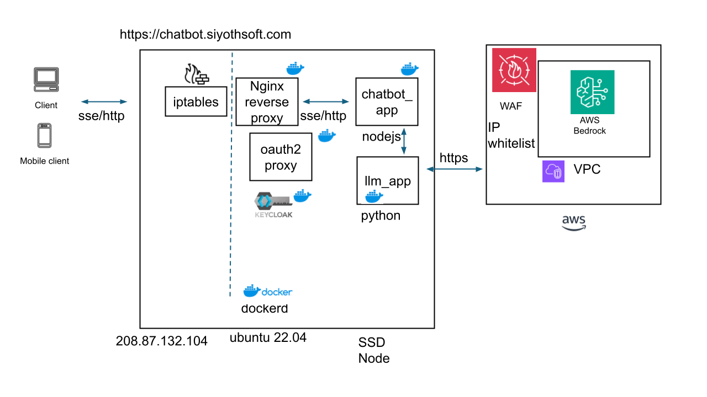

# Chatbot Microservices Architecture

This project consists of a chatbot application implemented using a **JavaScript client**, **Node.js (Express)** backend, and a **Python microservice** that communicates with **AWS Bedrock** to generate responses using **Anthropic Claude**.

The project is set up with a **microservice architecture** using **Nginx as a reverse proxy** with **OAuth2 Proxy, Keycloak** for authentication.

## Table of Contents
- [Architecture Overview](#architecture-overview)
- [Technologies Used](#technologies-used)
- [Project Setup](#project-setup)
- [Running the Project](#running-the-project)
- [Services Description](#services-description)
- [API Endpoints](#api-endpoints)

---

## Architecture Overview



- **JavaScript Client**: The client sends user inputs to the backend through an HTTP request.
- **Node.js (Express) Backend**: Receives requests from the client, forwards them to the Python microservice for processing, and streams back the responses using **Server-Sent Events (SSE)**.
- **Python Microservice**: Communicates with **AWS Bedrock** to use **Anthropic Claude-3** for generating text responses based on the input.
- **Nginx Reverse Proxy with OAuth2 Proxy with Keycloak**: Handles authentication and routes traffic between services.

---

## Technologies Used

- **Frontend**: JavaScript, HTML5, CSS
- **Backend**: Node.js, Express.js
- **Python Microservice**: Flask, AWS SDK (boto3)
- **AI Model**: AWS Bedrock - Anthropic Claude-3
- **Containerization**: Docker (if applicable)
- **Communication**: SSE (Server-Sent Events), HTTP
- **LLM Services**: AWS Bedrock, Anthropic Claude API
- **Authentication**: OAuth2 Proxy, with Keycloak

---

## Project Setup

### Prerequisites

- **Nginx** installed and configured as a reverse proxy
- **OAuth2 Proxy, KeyCloak** configured for authentication
- **AWS CLI** configured with the necessary credentials and permissions to access AWS Bedrock

### Clone the Repository

```bash
git clone git@github.com:shalinda/chatbot.git
cd chatbot
