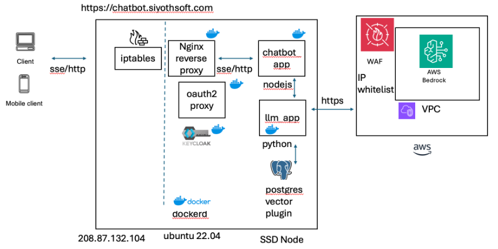

# Chatbot Microservices Architecture


This is an interactive chat application. whe no knoweldge base is selected it uses generic anthropic.claude-3-haiku-20240307-v1:0 model from bedrock to search and provide the response. User are able to build knowledge bases by preloading pdf documents to kb folder. Any Q n A against the knwoeldge base.

## Building knowledge base.

- Admin can upload documents to kb/knwledge base. Currently kb1 and kb2 areloaded
- use the back end to load data /api/upload_data1
- front end application requests are routed to chatbot_app node/ express application
- based on knowledge base those requests are been served by the llm_app python app
- /api/ask1 is internally used infer knowledge for the question being asked

## Authencation

- nginx is used as the api gateway
- oauth_proxy plugin is used with keycloak for authentication

## Implementation details

This project consists of a chatbot application implemented using a **JavaScript client**, **Node.js (Express)** backend, and a **Python microservice** that communicates with **AWS Bedrock** to generate responses using **Anthropic Claude**.

The project is set up with a **microservice architecture** using **Nginx as a reverse proxy** with **OAuth2 Proxy, Keycloak** for authentication.

---

## Table of Contents
- [Architecture Overview](#architecture-overview)
- [Technologies Used](#technologies-used)
- [API Endpoints](#api-endpoints)
- [Database Structure](#database-structure)
- [Docker Integration](#docker-integration)
- [Server-Sent Events (SSE)](#server-sent-events-sse)
- [Usage Instructions](#usage-instructions)
- [Architecture Diagram](#architecture-diagram)

---

## Architecture Overview

The chatbot architecture integrates multiple components for a scalable and efficient microservices-based system. The key components include:

- **Frontend:** Handles user interactions and communicates with the backend.
- **Node.js Backend:** Acts as a middleware between the frontend and the Python microservices.
- **Python Microservice:** Processes document embeddings, handles vector database operations, and integrates with AWS Bedrock for generating responses.
- **PostgreSQL Vector Database:** Stores embeddings and supports similarity-based queries.
- **Nginx:** Reverse proxy with authentication via OAuth2 Proxy and Keycloak.



---

## Technologies Used

1. **Frontend:**
   - JavaScript, HTML, CSS
   - Bootstrap for responsive design

2. **Backend:**
   - **Node.js (Express):** For handling client requests and SSE communication
   - **Python (Flask):** For processing requests and interacting with AWS Bedrock and PostgreSQL

3. **Database:**
   - PostgreSQL for storing and querying document embeddings

4. **Cloud Services:**
   - AWS Bedrock for generating text responses

5. **Authentication:**
   - OAuth2 Proxy with Keycloak

6. **Containerization:**
   - Docker for consistent deployment

---

## API Endpoints

### Node.js Backend

#### `GET /echo`
- **Description:** Echoes a message back to the client.
- **Query Parameters:**
  - `message`: The message to echo.
- **Response:** Streams the message back to the client.

---

### Python Microservices

#### **1. `faiss_controller.py`**

- **`POST /load_documents`**
  - **Description:** Load documents into a FAISS vector store.
  - **Request Body:**
    ```json
    {
      "file_path": "path/to/document"
    }
    ```
  - **Response:**
    ```json
    {
      "message": "Documents loaded to vector store. Number of elements in the index: <count>"
    }
    ```

- **`POST /ask`**
  - **Description:** Accepts a question, retrieves context from the vector store, and queries AWS Bedrock for an answer.
  - **Request Body:**
    ```json
    {
      "question": "User question"
    }
    ```
  - **Response:**
    ```json
    {
      "answer": "Generated answer"
    }
    ```

---

#### **2. `postgre_controller.py`**

- **`POST /load_documents1`**
  - **Description:** Loads documents into the PostgreSQL vector database.
  - **Request Body:**
    ```json
    {
      "file_path": "kb1"
    }
    ```
  - **Response:**
    ```json
    {
      "message": "Documents from kb1 loaded successfully."
    }
    ```

- **`POST /ask1`**
  - **Description:** Queries the vector database for relevant content and generates an answer using AWS Bedrock.
  - **Request Body:**
    ```json
    {
      "kb": "kb1",
      "question": "How did Amazons Advertising business do in 2023?"
    }
    ```
  - **Response:**
    ```json
    {
      "answer": "Amazon's advertising business performed exceptionally well in 2023, growing by X%."
    }
    ```

---

## Database Structure

PostgreSQL is used as a vector database to store and query document embeddings.

### Table: `document_embeddings`
| Column      | Type                  | Description                                   |
|-------------|-----------------------|-----------------------------------------------|
| `id`        | `integer`             | Primary key                                   |
| `kb`        | `text`                | Knowledge base identifier                    |
| `embedding` | `double precision[]`  | Array of vector embeddings                   |
| `content`   | `text`                | Text content of the document                 |
| `created_at`| `timestamp`           | Timestamp when the record was created        |

---

## Docker Integration

The chatbot is containerized using Docker, making it easy to deploy and scale. The system includes containers for:

1. **Backend Services:** Python and Node.js.
2. **PostgreSQL Vector Database.**
3. **Nginx for Reverse Proxy.**

### Key Docker Commands

- **Load Documents:**
  ```bash
  docker exec -it chatbot_app curl -X POST -H "Content-Type: application/json" -d '{"file_path": "kb2"}' --max-time 600 http://llm_app:3001/load_documents1
  ```

- **Query for Answers:**
  ```bash
  docker exec -it chatbot_app curl -X POST -H "Content-Type: application/json" -d '{"kb": "kb1", "question": "How did Amazons Advertising business do in 2023?"}' http://127.0.0.1:3001/ask1
  ```

---

## Server-Sent Events (SSE)

SSE is used to provide real-time communication between the server and client.

### Workflow
1. The client sends a request to the backend using `/echo`.
2. The server streams responses back in real-time.

---

## Usage Instructions

1. **Setup:**
   - Clone the repository:
     ```bash
     git clone <repository-url>
     ```
   - Install dependencies:
     - Node.js backend:
       ```bash
       cd backend
       npm install
       ```
     - Python backend:
       ```bash
       cd python
       pip install -r requirements.txt
       ```

2. **Run Services:**
   - Start the Python backend:
     ```bash
     python app.py
     ```
   - Start the Node.js backend:
     ```bash
     npm start
     ```

3. **Use Docker Compose for Deployment:**
   ```bash
   docker-compose up
   ```

---


This merged documentation provides a detailed guide for understanding the chatbot's architecture, API endpoints, database structure, Docker setup, and SSE communication. 